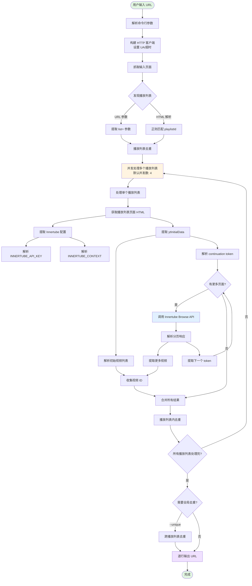
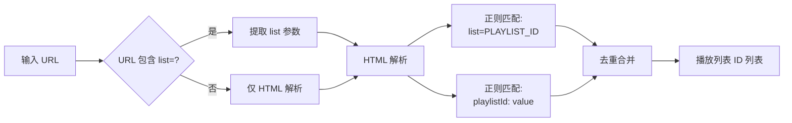
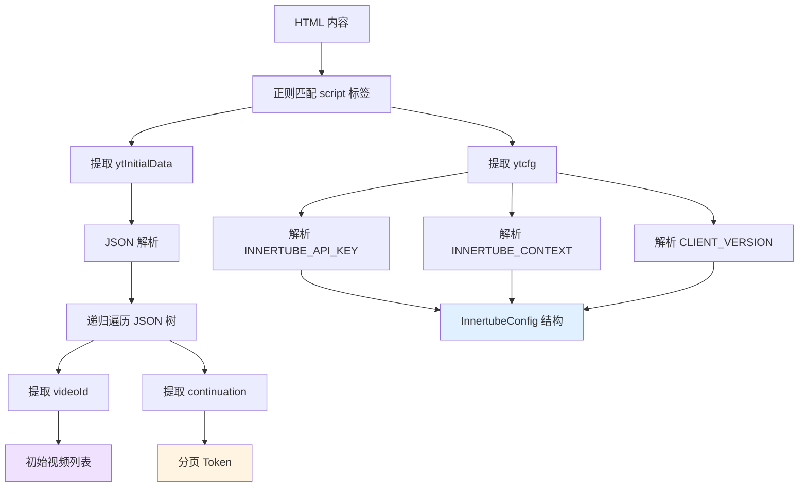
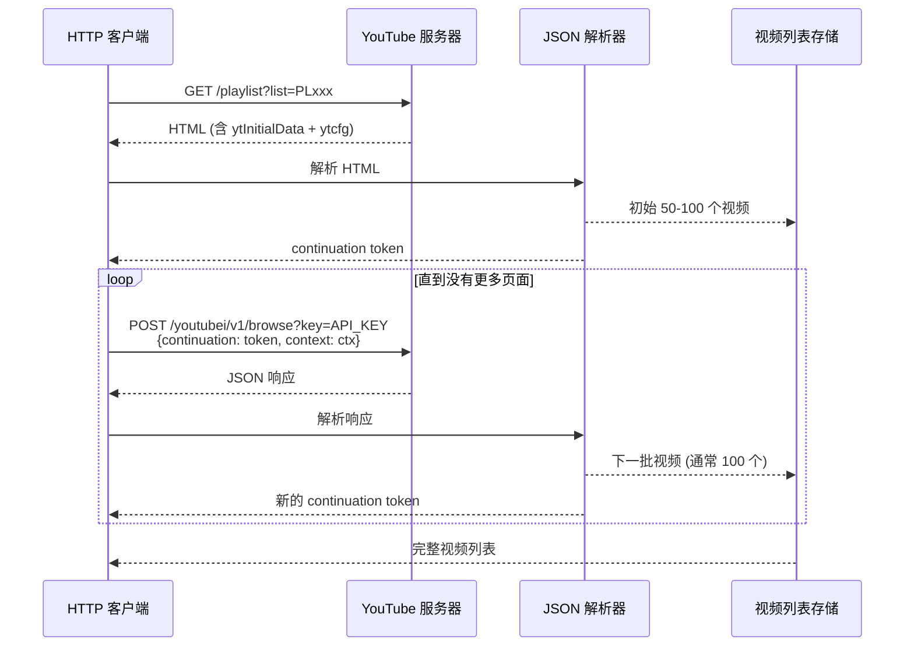
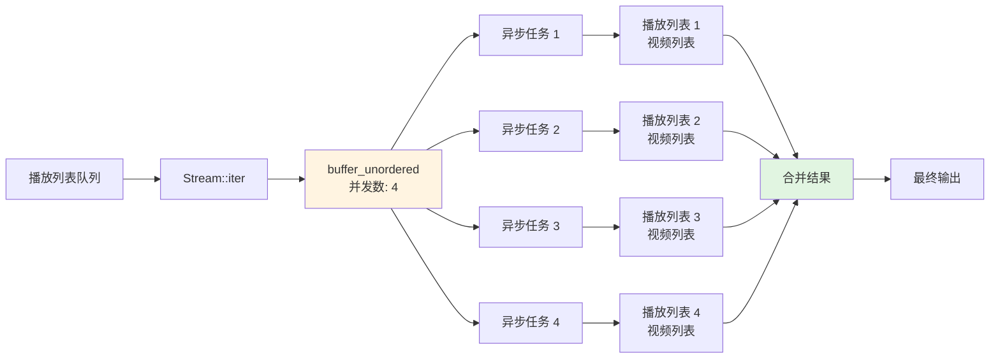
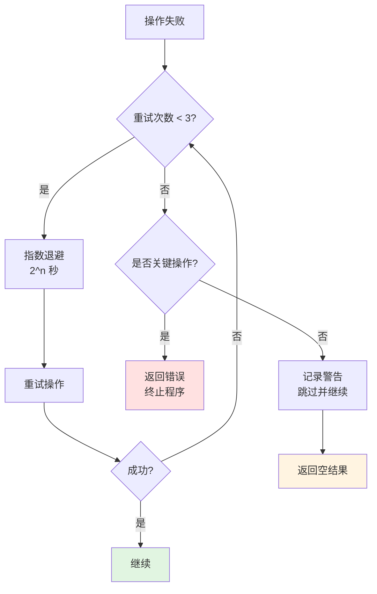

# ytextract 实现原理与架构

## 项目概述

`ytextract` 是一个 Rust 编写的命令行工具，用于从 YouTube 播放列表中提取所有视频链接。**无需 API Key**，通过解析 YouTube 页面的内部数据结构（`ytInitialData` 和 Innertube API）实现。

## 核心思想

YouTube 的页面在加载时会在 HTML 中嵌入 JavaScript 变量，包含：
1. **ytInitialData** - 初始页面数据（包括前 100 个视频）
2. **ytcfg** - YouTube 配置（包含 API Key 和 Context）
3. **Innertube Browse API** - 用于分页获取剩余视频

通过解析这些数据，我们可以：
- 发现页面中的所有播放列表
- 获取播放列表的初始视频列表
- 使用 continuation token 分页获取完整列表

## 架构设计

### 模块结构

```
ytextract/
├── src/
│   ├── main.rs          # CLI 入口，参数解析，流程控制
│   ├── extract.rs       # 核心提取逻辑：HTTP 请求、播放列表发现、并发处理
│   └── innertube.rs     # YouTube Innertube API：解析 ytInitialData、分页处理
├── Cargo.toml           # 依赖管理
└── README.md            # 使用说明
```

### 数据流程图



## 核心实现细节

### 1. 播放列表发现 (extract.rs)



**关键代码逻辑**：
- 使用 `url` crate 解析 URL 查询参数
- 使用 `regex` 匹配 HTML 中的播放列表引用
- 使用 `IndexSet` 保证顺序和去重

### 2. Innertube 配置提取 (innertube.rs)



**关键技术**：
- 正则表达式提取嵌入的 JavaScript 变量
- `serde_json` 解析复杂的嵌套 JSON
- 递归遍历查找特定字段（`videoId`, `continuation`）

### 3. 分页处理流程



**分页细节**：
- 初始页面：通常包含 50-100 个视频
- 每次分页：返回约 100 个视频
- Token 位置：`continuationContents.playlistVideoListContinuation.continuations[0].nextContinuationData.continuation`
- 无 Token：表示已到最后一页

### 4. 并发处理策略



**使用 Tokio + Futures**：
- `futures::stream::iter` 创建异步流
- `buffer_unordered` 控制并发数
- 避免触发 YouTube 速率限制

## 技术栈

### 核心依赖

| 依赖 | 版本 | 用途 |
|------|------|------|
| **clap** | 4.5 | CLI 参数解析（derive 宏） |
| **reqwest** | 0.12 | HTTP 客户端（支持 gzip/brotli） |
| **tokio** | 1.35 | 异步运行时 |
| **serde_json** | 1.0 | JSON 解析 |
| **regex** | 1.10 | 正则匹配 |
| **url** | 2.5 | URL 解析 |
| **anyhow** | 1.0 | 错误处理 |
| **futures** | 0.3 | 异步流处理 |
| **indexmap** | 2.1 | 有序去重集合 |

### 关键特性选择

```toml
[dependencies.reqwest]
features = [
    "json",           # JSON 请求/响应
    "cookies",        # Cookie 支持
    "gzip",           # gzip 压缩
    "brotli",         # brotli 压缩
    "rustls-tls"      # 纯 Rust TLS（无需 OpenSSL）
]
default-features = false  # 不使用默认 TLS
```

## 错误处理与容错



**容错策略**：
1. **网络错误**：自动重试 3 次，指数退避（2^n 秒）
2. **解析失败**：记录警告，返回空列表，不中断整体流程
3. **播放列表失败**：跳过该列表，继续处理其他
4. **私有/删除视频**：自动跳过，不影响其他视频

## 性能优化

### 1. 并发控制
- 默认并发数：4（可通过 `--concurrency` 调整）
- 每个播放列表独立异步处理
- 分页请求之间有 200ms 延迟

### 2. 内存优化
- 使用流式处理（Stream），不一次性加载所有数据
- `IndexSet` 自动去重，避免重复存储
- 只保存 `videoId`，不保存完整视频信息

### 3. 网络优化
- 启用 gzip/brotli 压缩
- 复用 HTTP 连接（连接池）
- 设置合理的超时时间（默认 20 秒）

## 数据结构

```rust
// Innertube 配置
struct InnertubeConfig {
    api_key: String,        // INNERTUBE_API_KEY
    context: Value,         // INNERTUBE_CONTEXT (JSON)
}

// CLI 参数
struct Args {
    url: String,            // 输入 URL
    unique: bool,           // 全局去重
    user_agent: Option<String>,
    timeout: u64,
    concurrency: usize,
    verbose: bool,
}
```

## 输出格式

**标准输出 (STDOUT)**：
```
https://www.youtube.com/watch?v=VIDEO_ID_1
https://www.youtube.com/watch?v=VIDEO_ID_2
https://www.youtube.com/watch?v=VIDEO_ID_3
```

**调试输出 (STDERR, --verbose)**：
```
[DEBUG] 抓取页面: URL
[DEBUG] 从 URL 发现播放列表: ID
[DEBUG] 从 HTML 发现 N 个播放列表
[INFO] 共发现 N 个播放列表
[DEBUG] 处理播放列表: ID
[DEBUG] 初始页面获取了 N 个视频
[DEBUG] 获取第 N 页...
[DEBUG] 分页完成，总共 N 页
[DEBUG] 从播放列表 ID 提取了 N 个视频
[INFO] 总共提取了 N 个视频
```

## 使用场景

### 场景 1：批量下载视频
```bash
ytextract "PLAYLIST_URL" | xargs -I {} yt-dlp {}
```

### 场景 2：归档播放列表
```bash
ytextract "PLAYLIST_URL" > archive_$(date +%Y%m%d).txt
```

### 场景 3：监控播放列表变化
```bash
# 定期运行并对比
ytextract "PLAYLIST_URL" > current.txt
diff previous.txt current.txt
```

### 场景 4：批量处理频道
```bash
ytextract "CHANNEL/playlists" --unique > all_videos.txt
```

## 局限性与已知问题

1. **结构依赖**：依赖 YouTube 页面结构，结构变化需要更新代码
2. **地区限制**：无法获取地区限制的内容
3. **年龄限制**：无法获取需要登录验证年龄的视频
4. **速率限制**：过高的并发可能触发 YouTube 限制（建议 ≤ 8）
5. **私有内容**：无法访问私有播放列表

## 未来改进方向

1. **Cookie 支持**：允许导入 cookies 访问需登录的内容
2. **代理支持**：添加代理配置绕过地区限制
3. **增量更新**：对比已有列表只输出新视频
4. **元数据输出**：可选输出视频标题、时长等信息
5. **JSON 输出**：支持 JSON 格式输出便于编程处理
6. **自动结构适配**：更智能的 JSON 路径查找

## 总结

`ytextract` 通过以下核心技术实现了无 API Key 的 YouTube 播放列表提取：

1. ✅ **HTML 解析** - 提取嵌入的 JavaScript 数据
2. ✅ **Innertube API** - 使用 YouTube 内部 API 分页
3. ✅ **并发处理** - 高效处理多个播放列表
4. ✅ **错误容错** - 自动重试和跳过失败项
5. ✅ **纯命令行** - STDOUT 输出便于管道处理

这是一个**轻量级**、**高效**、**可靠**的工具，适合批量视频处理场景。

